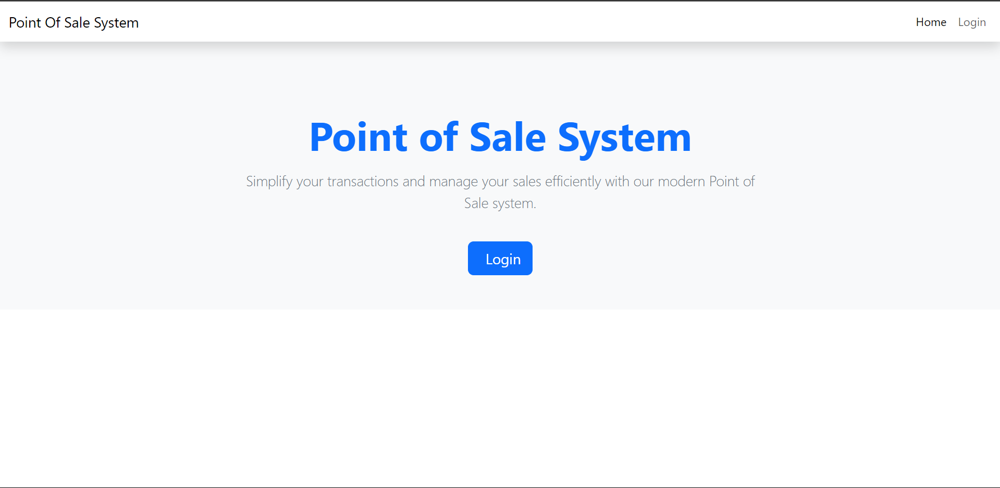

# Simple POS System in PHP and MySQL

A lightweight and user-friendly Point of Sale (POS) system built with PHP and MySQL for managing categories, products, customers, orders, and admin accounts.

---
<p align="center">
  
</p>

<div style="display: flex; justify-content: center; gap: 20px;">
   
   
   
   
   
   
   
   
   
   
   
   


</div>

## 📋 Requirements
- **Host:** Localhost
- **PHP Version:** 5.6 and above
- **Database:** MySQL DB  
  _(Database file is located in the `database` folder)_
- **Web Browser:** Chrome, Firefox, Internet Explorer, MS Edge

---

## 🔐 Login System
- Secure login system using PHP Sessions.
- Manage multiple admins:
  - Add, Edit, Update, and Delete Admin accounts.

---

## 🗂 Features

### 🏷️ Categories Management
- Add, Edit, Update, and Delete product categories.

### 📦 Product Management
- Add, Edit, Update, and Delete products.

### 👤 Customer Management
- Add, Edit, Update, and Delete customers.
- Customer data is used while creating orders.

### 🛒 Create Order
1. Select a product from the dropdown menu with search functionality (powered by **Select2**).
2. Specify the product quantity and add it to the session cart.
3. View added products in an HTML table format:
   - Increase or decrease product quantities.
   - Remove products from the list.
4. **Place an Order:**
   - Select a payment mode.
   - Enter the customer's phone number.
     - If the customer's phone number is not found in the records, you can create the customer in a **POP-UP/Modal** and proceed.
   - Review the order summary before confirming.

---

## 📋 Order Summary
In the Order Summary:
- Review customer details.
- Check invoice details:
  - Invoice Number
  - Invoice Date
- Verify product items.
- Modify product items, if needed, and return to the summary.
- Actions:
  - Save the order.
  - Print the order.
  - Download the order as a **PDF**.

---

## 📑 Orders
Manage all created orders with detailed information:
- View a list of orders including:
  - Tracking Number
  - Order Date
  - Payment Mode
  - Customer Details
- Filter orders by **Order Date** or **Payment Mode**.
- View individual orders:
  - Customer details
  - Order details
  - Product items
  - Print or download the bill as a **PDF**.

---

## 📊 Dashboard Analytics
Monitor key metrics at a glance:
- **Total Categories**
- **Total Products**
- **Total Orders**
- **Total Customers**


---

### 💾 Database
- The database file is located in the `database` folder for easy setup.

---
### CDN links/ packages:
- **Bootstrap**
    ```bash
    https://getbootstrap.com/
- **Sweet Alert**
    ```bash
    https://sweetalert2.github.io/

- **jsPDF library**
    ```bash
    https://cdnjs.com/libraries/jspdf
---
Enjoy managing your inventory and sales efficiently with this Simple POS System! 🎉

-- Christian Barbosa --- December 14, 2024 --12:30 --
